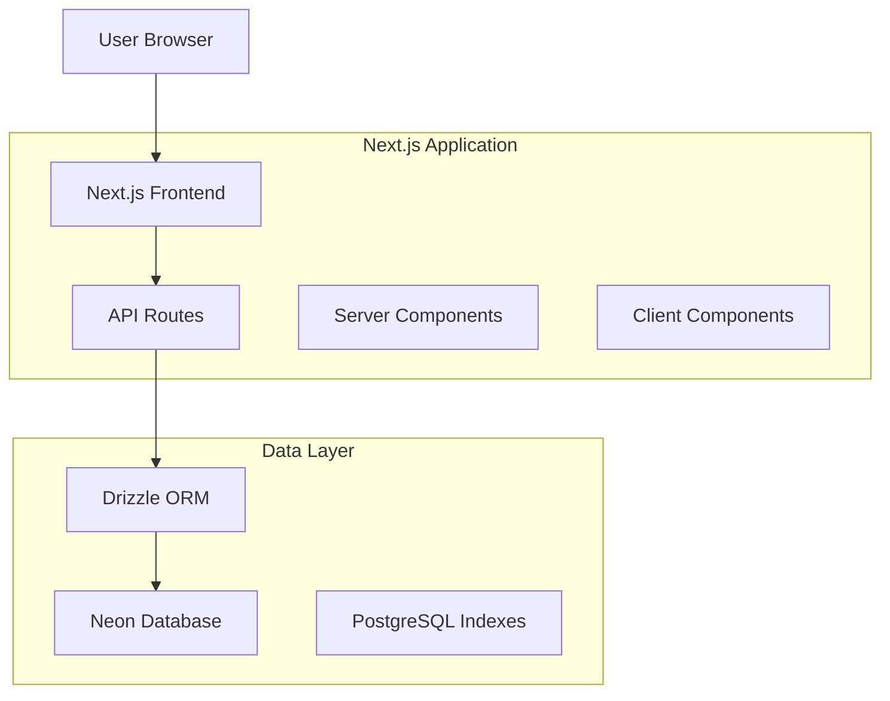

# Design Document

## Overview

The Product Safety Insights application is a Next.js web application that provides users with cosmetic product safety information. The system integrates with Neon database (serverless PostgreSQL) using Drizzle ORM for type-safe data access and querying of cosmetic safety databases. The application follows a modern, responsive design pattern with server-side rendering for optimal performance and SEO.

### Key Design Principles

- **User-First**: Prioritize clarity and ease of use over technical complexity
- **Performance**: Fast search results with progressive loading
- **Accessibility**: WCAG 2.1 AA compliant interface design
- **Reliability**: Robust error handling and graceful degradation

## Architecture

### High-Level Architecture



### Technology Stack

- **Frontend**: Next.js 15 with App Router, React 18, TypeScript
- **Backend**: Next.js API Routes
- **Database**: Neon (Serverless PostgreSQL) with CSV data pre-loaded
- **ORM**: Drizzle ORM for type-safe database operations
- **Styling**: Tailwind CSS with shadcn/ui components
- **State Management**: React Query for server state
- **Deployment**: Vercel

### Data Flow

1. User enters search query in the frontend
2. Client-side validation ensures minimum 3 characters
3. Search request sent to Next.js API route
4. API route uses Drizzle ORM to query Neon database with full-text search on pre-loaded CSV data
5. Response returned with product status and risk indicators
6. Frontend displays results with color-coded safety indicators
7. Alternative products fetched if needed

## Components and Interfaces

### Frontend Components

#### Core Components

```typescript
// Main search interface
SearchInterface {
  - SearchInput: Handles user input with validation
  - SearchResults: Displays product results with risk indicators
  - ProductCard: Individual product display with status
  - AlternativesSection: Shows safer product alternatives
  - LoadingStates: Skeleton screens and loading indicators
  - ErrorBoundary: Handles and displays errors gracefully
}

// Shared UI Components
UIComponents {
  - RiskIndicator: Color-coded safety status display
  - ProductDetails: Expandable product information
  - SearchFilters: Advanced search options (future)
  - Pagination: Results pagination for large datasets
}
```

#### Component Hierarchy

```
App Layout
├── Header (Navigation, Logo)
├── Main Content
│   ├── SearchInterface
│   │   ├── SearchInput
│   │   └── SearchResults
│   │       ├── ProductCard[]
│   │       ├── RiskIndicator
│   │       └── AlternativesSection
│   └── Footer
└── ErrorBoundary
```

### API Interfaces

#### Search API Endpoint

```typescript
// GET /api/products/search
interface SearchRequest {
  query: string;
  limit?: number;
  offset?: number;
}

interface SearchResponse {
  products: Product[];
  total: number;
  alternatives?: Product[];
  error?: string;
}

interface Product {
  id: number;
  name: string;
  notifNo: string;
  status: 'Notified' | 'Cancelled';
  riskLevel: 'safe' | 'unsafe' | 'unknown';
  reasonForCancellation?: string;
  applicantCompany?: {
    id: number;
    name: string;
  };
  manufacturerCompany?: {
    id: number;
    name: string;
  };
  dateNotified?: string;
  lastUpdated: string;
}
```

#### Alternatives API Endpoint

```typescript
// GET /api/products/alternatives
interface AlternativesRequest {
  excludeId?: number;
  category?: string;
  limit: number;
}

interface AlternativesResponse {
  alternatives: Product[];
  error?: string;
}
```

#### Banned Ingredients API Endpoint

```typescript
// GET /api/ingredients/banned
interface BannedIngredientsRequest {
  limit?: number;
  sortBy?: 'count' | 'name';
}

interface BannedIngredientsResponse {
  ingredients: BannedIngredient[];
  total: number;
  error?: string;
}

interface BannedIngredient {
  id: number;
  ingredientName: string;
  cancellationCount: number;
  riskExplanation: string;
}
```

### Database Schema

The database schema is designed to normalize company information and support advanced features like alternative product recommendations and banned ingredient analytics. Using Drizzle ORM for type-safe schema definitions.

#### Companies Table

```typescript
// src/lib/db/schema.ts
export const companies = pgTable(
  'companies',
  {
    id: serial('id').primaryKey(),
    name: varchar('name', { length: 255 }).notNull().unique(),
    createdAt: timestamp('created_at', { withTimezone: true }).defaultNow(),
    updatedAt: timestamp('updated_at', { withTimezone: true }).defaultNow(),
  },
  (table) => ({
    nameIdx: uniqueIndex('idx_companies_name').on(table.name),
  }),
);
```

#### Products Table

```typescript
export const products = pgTable(
  'products',
  {
    id: serial('id').primaryKey(),
    notifNo: varchar('notif_no', { length: 255 }).notNull().unique(),
    name: varchar('name', { length: 255 }).notNull(),
    applicantCompanyId: integer('applicant_company_id')
      .references(() => companies.id)
      .notNull(),
    manufacturerCompanyId: integer('manufacturer_company_id').references(() => companies.id),
    dateNotified: date('date_notified'),
    status: varchar('status', { length: 50 }).notNull(),
    reasonForCancellation: text('reason_for_cancellation'),
    createdAt: timestamp('created_at', { withTimezone: true }).defaultNow(),
    updatedAt: timestamp('updated_at', { withTimezone: true }).defaultNow(),
  },
  (table) => ({
    notifNoIdx: uniqueIndex('idx_products_notif_no').on(table.notifNo),
    nameIdx: index('idx_products_name').on(table.name),
    statusIdx: index('idx_products_status').on(table.status),
    // Full-text search will be handled via PostgreSQL extensions
  }),
);
```

#### Recommended Alternatives Table

```typescript
export const recommendedAlternatives = pgTable(
  'recommended_alternatives',
  {
    id: serial('id').primaryKey(),
    cancelledProductId: integer('cancelled_product_id')
      .references(() => products.id)
      .notNull(),
    recommendedProductId: integer('recommended_product_id')
      .references(() => products.id)
      .notNull(),
    relevanceScore: decimal('relevance_score', { precision: 5, scale: 2 }),
    createdAt: timestamp('created_at', { withTimezone: true }).defaultNow(),
    updatedAt: timestamp('updated_at', { withTimezone: true }).defaultNow(),
  },
  (table) => ({
    cancelledIdx: index('idx_reco_cancelled').on(table.cancelledProductId),
  }),
);
```

#### Banned Ingredient Analytics Table

```typescript
export const bannedIngredientAnalytics = pgTable(
  'banned_ingredient_analytics',
  {
    id: serial('id').primaryKey(),
    ingredientName: varchar('ingredient_name', { length: 255 }).notNull().unique(),
    cancellationCount: integer('cancellation_count').notNull().default(1),
    riskExplanation: text('risk_explanation').notNull(),
    createdAt: timestamp('created_at', { withTimezone: true }).defaultNow(),
    updatedAt: timestamp('updated_at', { withTimezone: true }).defaultNow(),
  },
  (table) => ({
    ingredientNameIdx: uniqueIndex('idx_banned_ingredients_name').on(table.ingredientName),
    countIdx: index('idx_banned_ingredients_count').on(table.cancellationCount),
  }),
);
```

#### Schema Design Rationale

**Normalization Benefits:**

- **Companies Table**: Eliminates duplicate company names and enables consistent company data management
- **Foreign Key Relationships**: Ensures data integrity between products and their associated companies
- **Separate Analytics Table**: Provides curated content for banned ingredients with explanations

**Performance Optimizations:**

- **Full-text Search**: PostgreSQL full-text search capabilities for fast product name and notification number searches
- **Status Indexing**: Optimized queries for filtering by product status (Notified vs Cancelled)
- **Company Lookups**: Indexed company names for efficient joins
- **Drizzle ORM**: Type-safe queries with compile-time validation

**Drizzle ORM Benefits:**

- **Type Safety**: Compile-time type checking for all database operations
- **Schema Migrations**: Automatic migration generation from schema changes
- **Query Builder**: Intuitive, SQL-like query syntax with TypeScript support
- **Performance**: Minimal runtime overhead with direct SQL generation

**Acceptance Criteria Alignment:**

- **AC 1.1.1**: Status field with 'Notified' or 'Cancelled' values
- **AC 1.3.1**: reason_for_cancellation field provides source for identifying banned ingredients
- **AC 1.4.1**: relevance_score in recommended_alternatives supports similarity algorithm
- **AC 2.2.1**: risk_explanation in banned_ingredient_analytics provides curated content
- **AC 2.3.1**: cancellation_count enables "Frequently Banned" list functionality

#### Data Source

The tables will be populated from CSV data containing cosmetic notifications and cancellations. The normalized structure allows for:

- Efficient company data management
- Advanced alternative product recommendations
- Automated banned ingredient analysis through backend scripts
- Type-safe data loading with Drizzle ORM

## Data Models

### Core Data Models

#### Company Model

```typescript
interface Company {
  id: number;
  name: string;
  createdAt: Date;
  updatedAt: Date;
}
```

#### Product Model

```typescript
interface Product {
  id: number;
  notifNo: string;
  name: string;
  applicantCompanyId: number;
  manufacturerCompanyId?: number;
  dateNotified?: Date;
  status: ProductStatus;
  reasonForCancellation?: string;
  createdAt: Date;
  updatedAt: Date;

  // Computed properties for UI
  riskLevel: RiskLevel;

  // Relationships
  applicantCompany?: Company;
  manufacturerCompany?: Company;
}

enum ProductStatus {
  NOTIFIED = 'Notified',
  CANCELLED = 'Cancelled',
}

enum RiskLevel {
  SAFE = 'safe',
  UNSAFE = 'unsafe',
  UNKNOWN = 'unknown',
}
```

#### Recommended Alternative Model

```typescript
interface RecommendedAlternative {
  id: number;
  cancelledProductId: number;
  recommendedProductId: number;
  relevanceScore?: number;
  createdAt: Date;
  updatedAt: Date;

  // Relationships
  cancelledProduct?: Product;
  recommendedProduct?: Product;
}
```

#### Banned Ingredient Analytics Model

```typescript
interface BannedIngredientAnalytics {
  id: number;
  ingredientName: string;
  cancellationCount: number;
  riskExplanation: string;
  createdAt: Date;
  updatedAt: Date;
}
```

````

#### Search Models
```typescript
interface SearchQuery {
  query: string;
  limit?: number;
  offset?: number;
}

interface SearchResult {
  products: Product[];
  total: number;
  alternatives?: Product[];
}
````

### Data Validation

```typescript
// Zod schemas for runtime validation
const CompanySchema = z.object({
  id: z.number().int().positive(),
  name: z.string().min(1).max(255),
  createdAt: z.date(),
  updatedAt: z.date(),
});

const ProductSchema = z.object({
  id: z.number().int().positive(),
  notifNo: z.string().min(1).max(255),
  name: z.string().min(1).max(255),
  applicantCompanyId: z.number().int().positive(),
  manufacturerCompanyId: z.number().int().positive().optional(),
  dateNotified: z.date().optional(),
  status: z.nativeEnum(ProductStatus),
  reasonForCancellation: z.string().optional(),
  createdAt: z.date(),
  updatedAt: z.date(),
});

const RecommendedAlternativeSchema = z.object({
  id: z.number().int().positive(),
  cancelledProductId: z.number().int().positive(),
  recommendedProductId: z.number().int().positive(),
  relevanceScore: z.number().min(0).max(999.99).optional(),
  createdAt: z.date(),
  updatedAt: z.date(),
});

const BannedIngredientAnalyticsSchema = z.object({
  id: z.number().int().positive(),
  ingredientName: z.string().min(1).max(255),
  cancellationCount: z.number().int().min(1),
  riskExplanation: z.string().min(1),
  createdAt: z.date(),
  updatedAt: z.date(),
});

const SearchQuerySchema = z.object({
  query: z.string().min(3).max(100),
  limit: z.number().min(1).max(50).default(10),
  offset: z.number().min(0).default(0),
});
```

## Error Handling

### Error Categories

1. **Validation Errors**: Client-side input validation failures
2. **Network Errors**: API connectivity issues
3. **Database Errors**: Neon database connection or Drizzle ORM query failures
4. **External API Errors**: Third-party service failures
5. **Application Errors**: Unexpected runtime errors

### Error Handling Strategy

#### Frontend Error Handling

```typescript
// Error boundary for React components
class ProductSafetyErrorBoundary extends ErrorBoundary {
  handleError(error: Error, errorInfo: ErrorInfo) {
    // Log error to monitoring service
    // Display user-friendly error message
    // Provide recovery options
  }
}

// API error handling with React Query
const useProductSearch = (query: string) => {
  return useQuery({
    queryKey: ['products', query],
    queryFn: () => searchProducts(query),
    enabled: query.length >= 3,
    retry: 2,
    onError: (error) => {
      // Display appropriate error message
      console.error('Search error:', error);
    },
  });
};
```

#### Backend Error Handling

```typescript
// API route error handling
export async function GET(request: Request) {
  try {
    const { searchParams } = new URL(request.url);
    const query = searchParams.get('query');

    // Validate input
    const validatedQuery = SearchQuerySchema.parse({ query });

    // Perform search with Drizzle ORM error handling
    const results = await searchProducts(validatedQuery);

    return NextResponse.json(results);
  } catch (error) {
    if (error instanceof z.ZodError) {
      return NextResponse.json({ error: 'Invalid search parameters' }, { status: 400 });
    }

    // Drizzle/Neon specific errors
    if (error instanceof Error && error.message.includes('connection')) {
      return NextResponse.json(
        { error: 'Search unavailable. Please try again later.' },
        { status: 503 },
      );
    }

    // Log unexpected errors
    console.error('Search API error:', error);
    return NextResponse.json({ error: 'An unexpected error occurred' }, { status: 500 });
  }
}
```

### Error Messages

- **Search Validation**: "Please enter at least 3 characters"
- **No Results**: "No products found. Try a different name or code."
- **Network Error**: "Search unavailable. Please try again later."
- **Database Error**: "Unable to connect to product database"
- **General Error**: "Something went wrong. Please refresh and try again."

## Testing Strategy

### Testing Pyramid

#### Unit Tests (70%)

- **Component Testing**: React Testing Library for UI components
- **Utility Functions**: Jest for data processing and validation
- **API Logic**: Test API route handlers and database queries
- **Data Models**: Validate schemas and transformations

#### Integration Tests (20%)

- **API Integration**: Test full API request/response cycles
- **Database Integration**: Test Drizzle ORM queries and Neon database data flow
- **Component Integration**: Test component interactions and state management

#### End-to-End Tests (10%)

- **User Workflows**: Playwright for critical user journeys
- **Cross-browser Testing**: Ensure compatibility across browsers

### Test Implementation

#### Component Testing Example

```typescript
// SearchInput.test.tsx
describe('SearchInput', () => {
  it('shows validation error for short queries', async () => {
    render(<SearchInput onSearch={mockOnSearch} />);

    const input = screen.getByRole('textbox');
    await user.type(input, 'ab');

    expect(screen.getByText('Please enter at least 3 characters')).toBeInTheDocument();
    expect(mockOnSearch).not.toHaveBeenCalled();
  });

  it('triggers search for valid queries', async () => {
    render(<SearchInput onSearch={mockOnSearch} />);

    const input = screen.getByRole('textbox');
    await user.type(input, 'lipstick');

    expect(mockOnSearch).toHaveBeenCalledWith('lipstick');
  });
});
```

#### API Testing Example

```typescript
// search.test.ts
describe('/api/products/search', () => {
  it('returns products for valid search', async () => {
    const response = await GET(new Request('http://localhost/api/products/search?query=lipstick'));
    const data = await response.json();

    expect(response.status).toBe(200);
    expect(data.products).toBeInstanceOf(Array);
    expect(data.total).toBeGreaterThanOrEqual(0);
  });

  it('returns 400 for invalid query', async () => {
    const response = await GET(new Request('http://localhost/api/products/search?query=ab'));

    expect(response.status).toBe(400);
    expect(await response.json()).toEqual({ error: 'Invalid search parameters' });
  });
});
```

### Performance Considerations

- **Database Indexing**: Proper indexes on search columns for fast queries
- **Query Optimization**: Efficient full-text search on pre-loaded CSV data

### Accessibility Testing

- **Automated Testing**: axe-core integration in tests
- **Color Contrast**: Validate WCAG AA compliance in code
